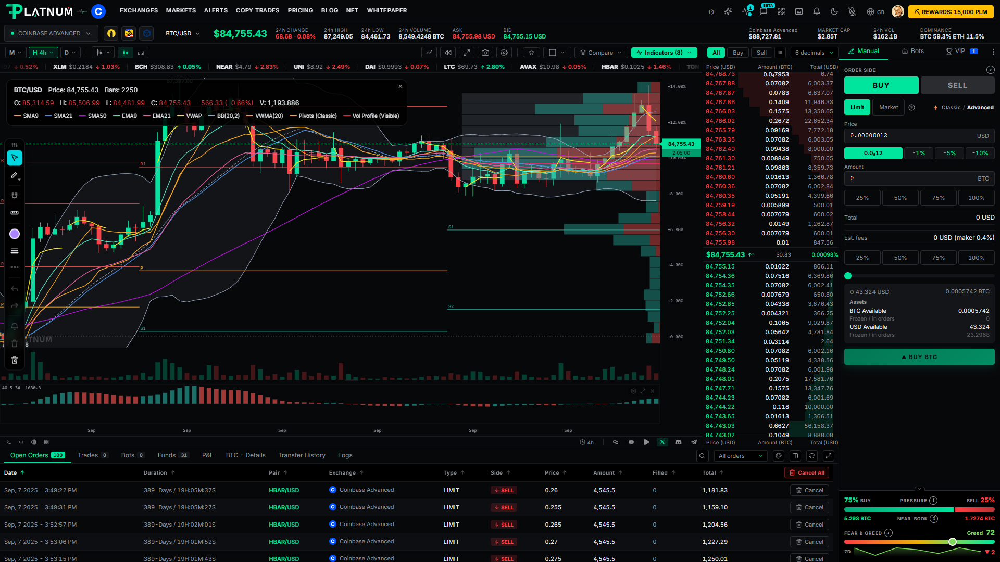
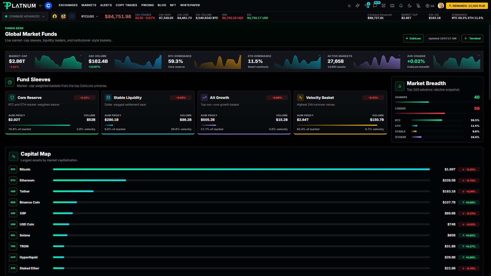
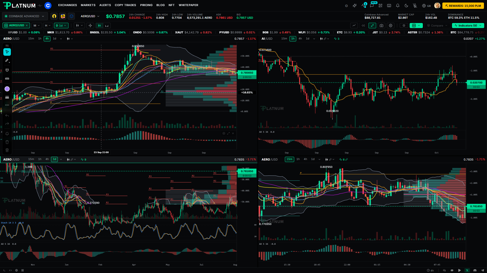

<div align="center">

<picture>
  <source media="(prefers-color-scheme: dark)" srcset="assets/logo-dark.svg">
  
</picture>

# Platnum Terminal — Desktop

**TradingView-grade charts, live order books, trading bots and multi-exchange trading in one native app.**

[](https://github.com/mirchmag-code/platnum-desktop/releases/latest)
[](https://github.com/mirchmag-code/platnum-desktop/releases)


[**Download**](https://platnum.app/download/windows) · [Web app](https://platnum.app) · [System status](https://status.platnum.app) · [Report an issue](https://github.com/mirchmag-code/platnum-desktop/issues)

</div>

---

## Screenshots

<p align="center">
  <a href="assets/screenshot-1.png"></a>
  <a href="assets/screenshot-2.png"></a>
  <a href="assets/screenshot-3.png"></a>
</p>

<p align="center"><sub>Click a screenshot to enlarge it.</sub></p>

## About this repository

This repository **distributes the installers** for Platnum Terminal. It holds release binaries, the auto-update feed and the images shown on this page, nothing else. The application source lives in a private repository.

The web version of the terminal is always available at [platnum.app](https://platnum.app). The desktop app runs the same terminal in a native window, adding OS integration, `platnum://` deep links and automatic updates.

## Download

Pick the installer for your system. These links always resolve to the newest published release.

| Platform | Architecture | Installer | Direct link |
|---|---|---|---|
| **Windows** 10/11 | x64 | `.exe` (NSIS installer) | [Platnum-Terminal-win-x64.exe](https://github.com/mirchmag-code/platnum-desktop/releases/latest/download/Platnum-Terminal-win-x64.exe) |
| **macOS**: Apple Silicon (M1 and later) | arm64 | `.dmg` | [Platnum-Terminal-mac-arm64.dmg](https://github.com/mirchmag-code/platnum-desktop/releases/latest/download/Platnum-Terminal-mac-arm64.dmg) |
| **macOS**: Intel | x64 | `.dmg` | [Platnum-Terminal-mac-x64.dmg](https://github.com/mirchmag-code/platnum-desktop/releases/latest/download/Platnum-Terminal-mac-x64.dmg) |
| **Linux**: any distro | x64 | `.AppImage` | [Platnum-Terminal-linux-x64.AppImage](https://github.com/mirchmag-code/platnum-desktop/releases/latest/download/Platnum-Terminal-linux-x64.AppImage) |
| **Linux**: Debian / Ubuntu | x64 | `.deb` | [Platnum-Terminal-linux-x64.deb](https://github.com/mirchmag-code/platnum-desktop/releases/latest/download/Platnum-Terminal-linux-x64.deb) |
| **Linux**: Fedora / RHEL / openSUSE | x64 | `.rpm` | [Platnum-Terminal-linux-x64.rpm](https://github.com/mirchmag-code/platnum-desktop/releases/latest/download/Platnum-Terminal-linux-x64.rpm) |

Shortcut URLs that redirect to the same files:
`platnum.app/download/windows` · `/download/mac` · `/download/mac-intel` · `/download/linux` · `/download/linux/deb` · `/download/linux/rpm`

Installer file names carry no version number, so the links above never go stale. The version is shown on each [release page](https://github.com/mirchmag-code/platnum-desktop/releases).

## Installation

### Windows

1. Download `Platnum-Terminal-win-x64.exe`.
2. Run it. The installer lets you choose the install folder.
3. Launch **Platnum Terminal** from the Start menu.

> **SmartScreen warning.** Builds are not yet code-signed with a Windows certificate. If Windows shows *"Windows protected your PC"*, choose **More info → Run anyway**.

### macOS

1. Download the `.dmg` that matches your Mac: **arm64** for Apple Silicon, **x64** for Intel. (Apple menu → *About This Mac* shows the chip.)
2. Open the `.dmg` and drag **Platnum Terminal** into **Applications**.
3. Launch it from Applications.

> **Gatekeeper warning.** Apple notarization is not yet in place. If macOS says the app *"cannot be opened because the developer cannot be verified"*, right-click the app → **Open** → **Open**. You only need to do this once. Alternatively: **System Settings → Privacy & Security → Open Anyway**.

### Linux

**AppImage (any distribution)**

```bash
chmod +x Platnum-Terminal-linux-x64.AppImage
./Platnum-Terminal-linux-x64.AppImage
```

If it fails to start on a recent Ubuntu or Debian, install FUSE 2 (`sudo apt install libfuse2`) or run it with `--appimage-extract-and-run`.

**Debian / Ubuntu (`.deb`)**

```bash
sudo apt install ./Platnum-Terminal-linux-x64.deb
```

**Fedora / RHEL / openSUSE (`.rpm`)**

```bash
sudo dnf install ./Platnum-Terminal-linux-x64.rpm      # Fedora, RHEL
sudo zypper install ./Platnum-Terminal-linux-x64.rpm   # openSUSE
```

## Docker

> **Coming soon.** The container image is not published yet. These instructions go live with the first public image; until then use the installers above.

Prefer to run Platnum Terminal on your own machine or a home server? The same terminal is available as a self-hosted container: it serves the web app on `http://localhost:8080`, while your account and exchange keys stay on Platnum's backend (the container holds no keys and stores nothing).

**Requirements:** Docker 24 or newer with the Compose plugin, a 64-bit Intel/AMD or ARM machine, and outbound HTTPS to platnum.app and your exchanges.

```bash
# One command
docker run -d --name platnum -p 127.0.0.1:8080:8080 --restart unless-stopped ghcr.io/mirchmag-code/platnum-terminal:stable
```

```bash
# Or with Compose, which also gives you updates
curl -fsSLo docker-compose.yml https://platnum.app/download/docker
docker compose up -d
```

Open <http://localhost:8080> and sign in with your email and password.

| Update | Command |
|---|---|
| By hand | `docker compose pull && docker compose up -d` |
| Automatically, checked every 6 hours | `docker compose --profile autoupdate up -d` |

The automatic updater needs access to the Docker socket, which is full control of Docker on that machine, so it is off unless you turn it on. The `stable` tag only moves after a release has been checked by hand. Pin a version with `PLATNUM_IMAGE=ghcr.io/mirchmag-code/platnum-terminal:<version> docker compose up -d`.

By default only the machine running Docker can reach the container. To open it from another device, put HTTPS in front of it (for example a Caddy `reverse_proxy 127.0.0.1:8080`) rather than exposing the port directly.

## Verifying your download

Only download Platnum Terminal from this repository or from `platnum.app`. Compute your file's SHA-256 and compare it with a second download from the release page if you want to confirm the file arrived intact:

```bash
# macOS / Linux
shasum -a 256 Platnum-Terminal-mac-arm64.dmg

# Windows (PowerShell)
Get-FileHash .\Platnum-Terminal-win-x64.exe -Algorithm SHA256
```

## Automatic updates

Installed copies check this repository's releases and update themselves in the background. When a new version is ready, the app shows a toast asking you to restart.

| Installer | Auto-update |
|---|---|
| Windows `.exe` | ✅ |
| macOS `.dmg` | ✅ |
| Linux `.AppImage` | ✅ |
| Linux `.deb` / `.rpm` | Install the new package manually, or use the AppImage for self-updates |

The update feed files (`latest.yml`, `latest-mac.yml`, `latest-linux.yml`) in each release are what the updater reads. **Do not delete them.**

## Sign-in and deep links

The desktop app registers the `platnum://` URL scheme. Signing in with Google or another provider opens your browser, then returns to the app through `platnum://auth-callback`, so you stay in the desktop window. If your browser asks whether to open Platnum Terminal, allow it.

## System requirements

| | Minimum |
|---|---|
| **Windows** | Windows 10 (64-bit) or later |
| **macOS** | A current macOS release, Apple Silicon or Intel |
| **Linux** | 64-bit distribution with glibc and GTK 3 (Ubuntu 20.04+, Debian 11+, Fedora 36+ or equivalent) |
| **Network** | Internet connection (live market data and exchange access) |
| **Memory** | 4 GB RAM recommended |

## Security and your keys

- Exchange API secrets are **never held in the app**. Authenticated requests are signed server-side; the desktop app only holds your session.
- Release assets are built by CI from tagged commits of the private source repository, then published here.
- Found a vulnerability? Please report it privately rather than in a public issue, using the contact on [platnum.app](https://platnum.app).

## Troubleshooting

| Problem | Fix |
|---|---|
| Windows blocks the installer | See the [SmartScreen note](#windows). Choose **More info → Run anyway**. |
| macOS says the app is damaged or unverified | See the [Gatekeeper note](#macos). Right-click → **Open**. |
| AppImage does nothing when launched | `chmod +x` the file; install `libfuse2`; or run with `--appimage-extract-and-run`. |
| Wrong macOS build (slow or won't open) | Use **arm64** on Apple Silicon and **x64** on Intel. |
| Sign-in doesn't return to the app | Allow the browser's "Open Platnum Terminal" prompt, then retry. |
| Data looks stale or an exchange is failing | Check [status.platnum.app](https://status.platnum.app). |

Still stuck? [Open an issue](https://github.com/mirchmag-code/platnum-desktop/issues) with your OS and version, the installer you used, and what happened.

## Release history

Every version, with notes, is on the [Releases page](https://github.com/mirchmag-code/platnum-desktop/releases).

## License and notices

© 2026 Platnum. All rights reserved. The binaries in this repository are provided for use under the terms published at [platnum.app](https://platnum.app). Trading involves risk; Platnum Terminal is a tool, not financial advice.
